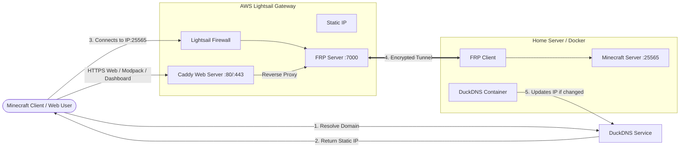

# Hybrid Cloud Minecraft Infrastructure

This project deploys a secure Minecraft server using a Hybrid Cloud Architecture.

Game Server: Runs locally, dockerized on your hardware.

Gateway: Runs on a cheap AWS Lightsail instance (provisioned with Terraform).

Tunnel: Traffic is securely tunneled (FRP) from the Cloud to your local.

Web Frontend: Serves a secure HTTPS server status page, a modpack download link, and a reverse-proxied management dashboard via Caddy.

## System Architecture



## Benefits

- Provides DDoS protection via AWS.
- Low cost (uses cheap cloud compute only for traffic forwarding).
- Hides your home IP address.
- Portable config (Infrastructure as Code).
- Zero-config SSL/HTTPS via Caddy.
- Automated Modpack distribution for seamless player onboarding.
- Secure, encrypted access to the FRP management dashboard.

## Repository Structure

cloud/ - Terraform code to provision the AWS Lightsail Gateway, Caddyfile, and static HTML templates.

local/ - Docker Compose files to run the Minecraft Server & Tunnel Client.

local/config-overrides/ - Game configuration (Whitelists, MOTD, etc.).

local/client-mods/ - Extra client-side `.jar` mods to be injected into the distributed modpack.

local/build-modpack.sh - Automation script to bundle the custom client modpack.

## Prerequisites

Terraform Installed: sudo apt install terraform

AWS CLI Installed: sudo apt install awscli

Docker & Compose: Installed on your local machine.

DuckDNS Account: A domain (e.g., "myserver.duckdns.org") and a Token.

AWS IAM User: With LightsailFullAccess permissions.

<details> <summary>Custom IAM Policy - LightsailFullAccess</summary>

```json
{
	"Version": "2012-10-17",
	"Statement": [
		{
			"Effect": "Allow",
			"Action": ["lightsail:*"],
			"Resource": "*"
		}
	]
}
```

</details>

## Setup Guide

### Phase 1: The Cloud Gateway (AWS)

1. Configure credentials - Create a (preferably, named) profile for Terraform to use.

```bash
aws configure --profile "terraform-lightsail"
```

Region: eu-west-2 (or your preference)
Output: json

2. Configure Terraform variables - Create your secret variables file.

```bash
cp cloud/terraform.tfvars.template cloud/terraform.tfvars
```

Edit cloud/terraform.tfvars and add your DuckDNS Token, Domain, and Dashboard credentials.

3. Deploy Infrastructure - Terraform will provision the server, install Docker, set up Caddy, and start the tunnel server.

```bash
cd cloud
terraform init
terraform apply
```

Verify: The public_ip output matches the IP on your DuckDNS dashboard.

Note: Terraform generates an SSH key (id_rsa.pem) in the cloud/ folder. Keep this private.

### Phase 2: The Game Server (Local)

1. Configure Secrets - set up the tunnel client authentication.

```bash
cd local
cp .env.template .env
```

Edit .env to match the tokens used in Terraform.

2. Configure Game Rules & Whitelist - We use split configuration to keep secrets out of Git.

local/config-overrides/minecraft-public.env: (Commit this) Game rules, MOTD, Difficulty.

local/config-overrides/minecraft-private.env: (GitIgnored) Whitelist, Ops, Sensitive settings.

3. Start the Server

```bash
docker-compose up -d
```

Check Logs: `docker-compose logs -f`

Wait for: Done! (Server Ready) and [ssh] start proxy success (Tunnel Ready).

### Phase 3: Modpack Distribution

To ensure your players have the exact mods and configs as your server:

1. Download the base modpack zip (e.g., ATM10) directly from the CurseForge website.
2. Place it in the `local/` directory and name it `base-modpack.zip`.
3. Drop any extra client-side `.jar` files into `local/client-mods/`.
4. Deploy the modpack to the web server:

```bash
make deploy-modpack
```

Players can now visit `https://yourdomain.duckdns.org` to check server status and download the compiled modpack.

How to Connect
Server Address: yourdomain.duckdns.org

Port: Default (25565) - No port number needed in client.

## Management & Troubleshooting

### Accessing the FRP Dashboard

Your FRP tunnel traffic and connection health can be monitored securely via the web dashboard.

1. Navigate to `https://yourdomain.duckdns.org:7500`.
2. Log in using the `frp_dashboard_creds` defined in your `terraform.tfvars` file.

### SSH Access to Cloud Gateway

Terraform generates a keypair automatically. To debug the cloud server:

```bash
make cloud-ssh
```

### Managing Players (Ops/Whitelist)

**Do not use in-game commands like /whitelist add as they will be overwritten on restart.**

Edit local/config-overrides/minecraft-private.env.

Add names to OPS= or WHITELIST=.

Apply changes:

```bash
docker-compose up -d
```

### How to Change Modpacks

Switching from one modpack to another requires clearing old mod files while preserving your world data.

1. Stop the server: `docker-compose down`
2. Update `MODPACK_SLUG` and `DATA_FOLDER` in your `.env` file to point to the new pack.
3. Download the new client zip from CurseForge and replace `local/base-modpack.zip`.
4. Run `make deploy-modpack` to update the web download.
5. Start the server: `docker-compose up -d`

### How to Restore World Backups

Backups are automatically generated by the backup container and stored in local/backups/.

1. Stop the server

```bash
docker-compose down
```

2. Locate the backup

```bash
cd local/backups
ls -lh
```

Example file: 2026-02-08_12-00-00.tgz

3. Move or delete the current world folder to prevent file conflicts.

```bash
cd ../minecraft-data
mv world ../corrupted/
```

OR

```bash
sudo rm -rf world
```

4. Extract the backup

```bash
# Adjust the filename below to match your backup
sudo tar -xzvf ../backups/2026-02-08_12-00-00.tgz -C .
```

5. Fix permissions - Files extracted via sudo are owned by root. The Minecraft container runs as a specific user (UID 1000) and will crash if it cannot read them.

```bash
sudo chown -R 1000:1000 .
```

6. Restart server

```bash
cd ..
docker-compose up -d
```

### Common Issues

"Connection Refused": Check if the Tunnel is up (`make frpc-logs`).

"Unknown Host": DNS propagation lag. Wait 5 mins or try the raw IP.

Wrong IP in DuckDNS/Lightsail: Run `make cloud-apply` again to force an update.
